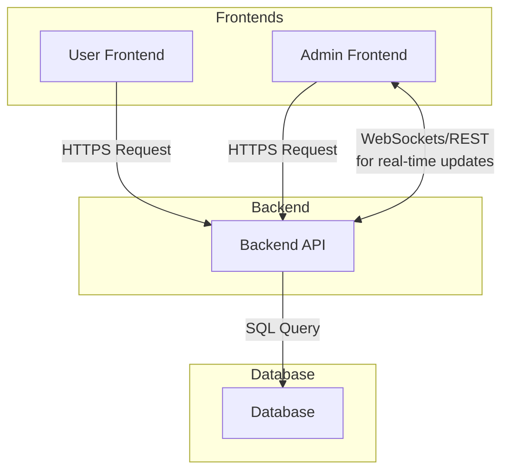

# System Architecture Overview

## Components

- **Frontend (User):**

  - React + Vite SPA for end users
  - Handles login, registration, dashboard, notifications, etc.
  - Communicates with backend via REST API (JWT auth, httpOnly cookies)

- **Admin Frontend:**

  - React + Vite SPA for administrators
  - Handles admin login, user/role management, admin dashboard
  - Communicates with backend via REST API (separate admin endpoints)

- **Backend API:**

  - Node.js + Express + TypeScript
  - Prisma ORM for database access
  - JWT-based authentication (access/refresh tokens)
  - Role-based access control (admin/user separation)
  - RESTful endpoints for all business logic
  - Real-time notifications via WebSockets or polling

- **Database:**
  - PostgreSQL (default, can be swapped for MySQL)
  - Managed via Prisma schema and migrations

## Authentication Flow

- Both frontends support "remember me" (persistent or session-based auth)
- Backend sets httpOnly refresh token cookies with appropriate expiry
- Access tokens are short-lived and stored in memory

## Dev & Test Tools

- Seed script for initial data and safe upserts
- `/test/reset-db` endpoint for resetting and reseeding the database

---

This diagram and description provide a high-level overview of how the user app, admin dashboard, backend API, and database interact in your project.
